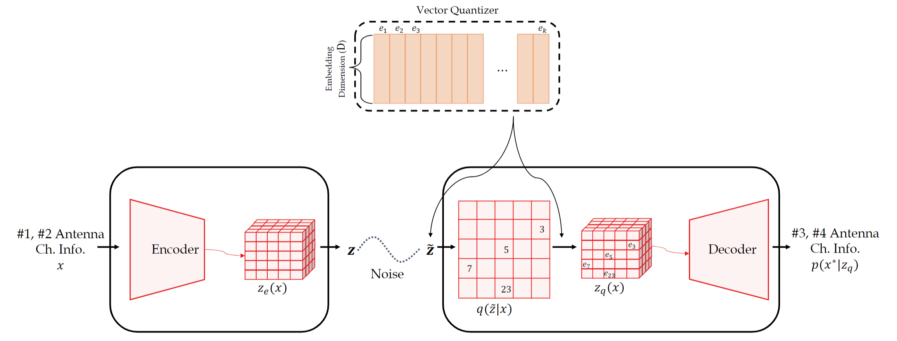
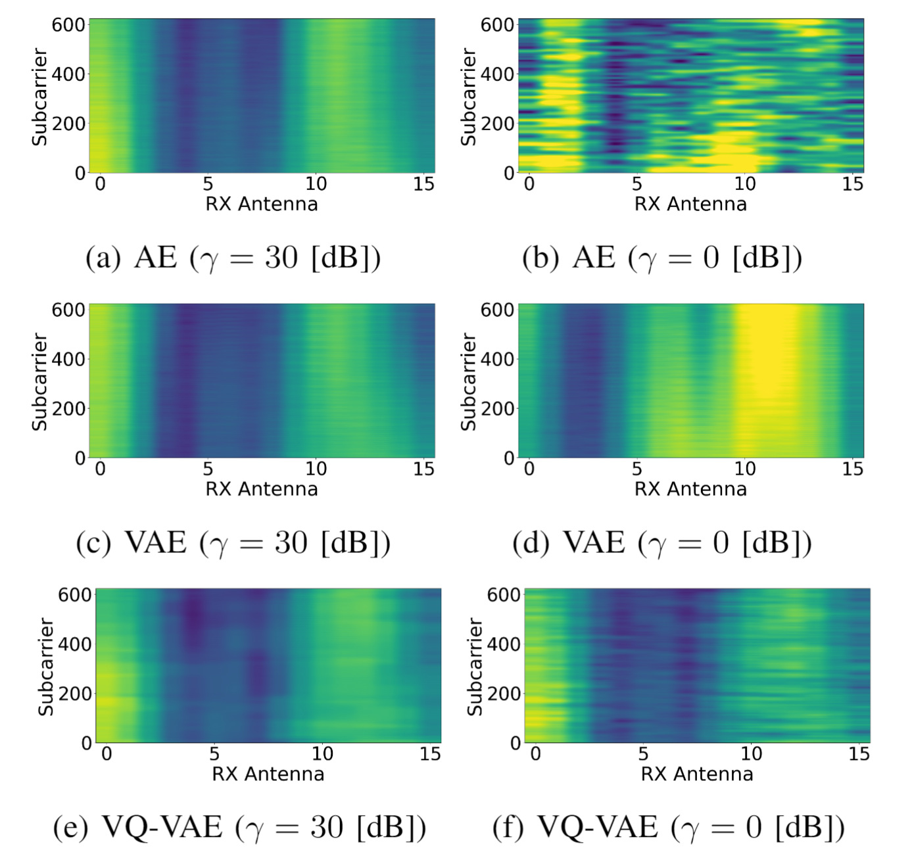
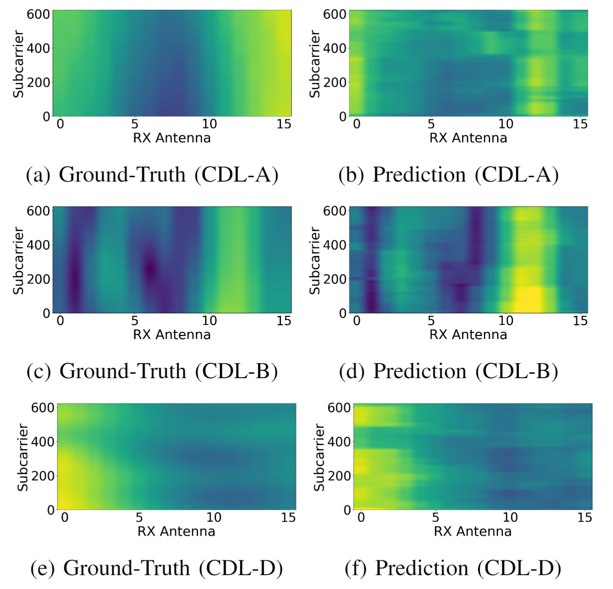

# Generative vs. Predictive Models in Massive MIMO Channel Prediction

This repo includes the selected results of our paper ["Generative vs. Predictive Models in Massive MIMO Channel Prediction"](https://arxiv.org/abs/2411.16971), <em>presented at Asilomar 2024</em>.


## Citation

```bash
@misc{lee2024generative,
    author = {Ju-Hyung Lee and Joohan Lee and Andreas F. Molisch},
    title = {Generative vs. Predictive Models in Massive {MIMO} Channel Prediction},
    journal={arXiv preprint arXiv:2411.16971},
    year = {2024},
}
```

## Highlights
- This work evaluates AE-based Generative and Predictive models, finding that Generative models excel in noisy settings. 
- Furthermore, we introduce a Vector Quantization (VQ)-based generative AE model (VQ-VAE) specifically for noisy mMIMO channel prediction. 
- The VQ-VAE model significantly surpasses traditional AE and other generative models, achieving up to approximately 15 [dB] NMSE accuracy gains over standard AEs and about 9 [dB] over VAE models.

<div align="center">

</div>


## Results

### Comparative Analysis: 
- [Qualitative Analysis] Comparison of Prediction Results from Generative and Predictive Models under Good ($γ$ = 30 [dB]) and Noisy ($γ$ = 0 [dB]) Channel Conditions (Latent dim. = 64).
<div align="center">

</div>

### OOD (Out-of-Distribution) Resultss

- [Generalization Capability] Prediction Results of the Proposed VQ-VAE on Out-Of-Distribution (OOD) Channels ($γ$ = 30 [dB], Latent dim. = 64).
<div align="center">

</div>

### Complexity Analysis

| #       | Inference time [s] | Memory [MB]  | 
| ------- | ------------------ | ------------ | 
| AE      | 3.374              | 62.67          | 
| VAE     | 4.442              | 108.59          | 
| VQ-VAE  | 5.340              | 175.20          | 
| ------- | ------------------ | ------------ | 
| Diffusion (DDPM)  | 122.624              | 1385.41    | 
